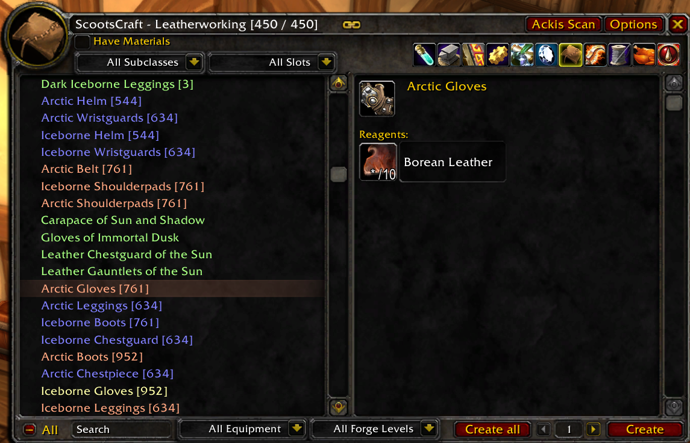

## Description ##

This is a complete overhaul of the professions system designed to drastically improve the experience.

Comes bundled with a slightly modified AckisRecipeList so the scan button can be placed correctly.

Features:
* All professions integrated into a single panel.
* Filters, collapsed sections, and scroll position is preserved between professions to ease switching between professions.
* All Blizzard interface actions should be faithfully restored.
* Additional filter for attuneable equipment (Unfiltered, attuneable (account), or attuneable (character)).
* Additional filter for attuned forge level.
* Additional filter to only show equipment.
* Clicking on a reagent will show the craft for that reagent if it is from the same profession.

## Usage ##

* Open any profession to display the ScootsCraft panel.
* Type `/scootscraft toggle` to switch between ScootsCraft and the default Blizzard profession system.
* There are also buttons available to toggle this option.

## Installation ##

Download this repository, then extract the contents from the `src` directory into your `World of Warcraft/Interface/AddOns` directory.

## Screenshots ##

