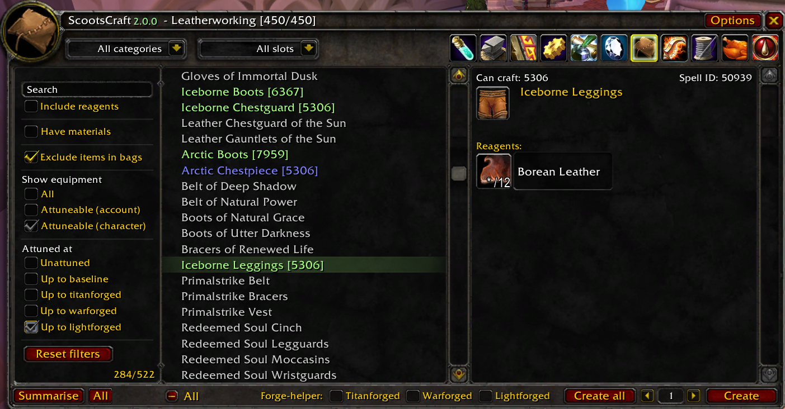
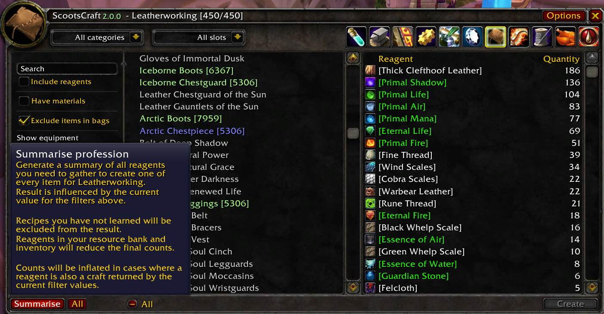
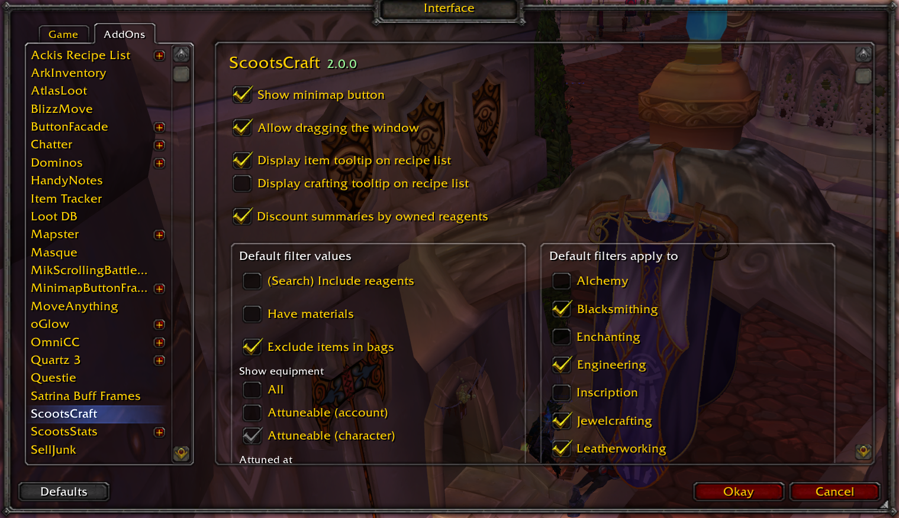

## Description ##

This is a complete overhaul of the professions system designed to drastically improve the experience.

Features:
* All professions integrated into a single panel.
* Filters, collapsed sections, and scroll position is preserved between professions to ease switching between professions.
* All Blizzard interface actions should be faithfully restored.
* Additional filters to aid attuning everything.
* Clicking on a reagent will show the craft for that reagent if it is craftable.
* Generate a summary of materials required to complete a/all profession(s), influenced by your current filter values.
* A "forge helper" system, to auto-sell/destroy crafted items if they fail to forge to the desired level.

## Usage ##

To open, either:
* Type `/scootscraft`.
* Left-click the minimap icon.
* Configure a key-bind for "ScootsCraft / Toggle window" in the game Key Bindings menu.

## Installation ##

Download this repository, then extract the contents from the `src` directory into your `World of Warcraft/Interface/AddOns` directory.

## Screenshots ##

